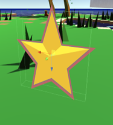

**The University of Melbourne**
# COMP30019 – Graphics and Interaction

## Teamwork plan/summary

<!-- [[StartTeamworkPlan]] PLEASE LEAVE THIS LINE UNTOUCHED -->

<!-- Fill this section by Milestone 1 (see specification for details) -->
Weekly meeting 12am Sat
Merge request when finished
---TASKS---
Desert/ Rivers/ Trees/ Stone/Fog (Maps/World)
Main Character ------(TBD)
Character/Camera movement
Items (food, power-ups, tools)
Game logic (
1. free to move by WASD, jump, attack, pick up items when you walk through them 
2. Food spawning within a distance to the player, will disappear later
3. As time passed by, more items will show up and the game gets harder
4. The knight has a HP of 30 Maxima, lose 1 HP every second
5. Power-up items are used in effect immediately as you pick up
6.  Obstacle may block the path
UI (Health bar -- (dimming the screen), a menu page(new game, exit, in-game pause)
Shaders (maps, characters, items, "enemies", UI)
Sound effects(movement, interactions, death, environment)

<!-- [[EndTeamworkPlan]] PLEASE LEAVE THIS LINE UNTOUCHED -->
## Work Split
### Ryan      rrgo@student.unimelb.edu.au 1191761
Terrain generation\
Terrain and player interaction\
Item spawning\
Item and player interaction
### Taelot xingruiq@student.unimelb.edu.au 1324520
Scene building\
Items and player interaction\
Player status\
HUD visual effects
### Yung yungchingl@student.unimelb.edu.au 967875
Shaders\
Particles and interaction\
Player Animation\
Player movement\
illustration

## Table of contents
* [Game Summary](#game-summary)
* [Technologies](#technologies)
* [Gameplay Related Desgin decisions](#game-related-design-decisions)
* [Design of Game Objects](#design-of-game-objects)
* [Graphics Pipeline](#graphics-pipeline)
* [Partical System](#particle-system)
* [Procedural generation](#procedural-generation)
* [Querying](#querying)
* [Analyze Feedback and Changes](#analyze-feedback-and-changes)
* [References](#references)

## Final report

Read the specification for details on what needs to be covered in this report... 

Remember that _"this document"_ should be `well written` and formatted **appropriately**. 
Below are examples of markdown features available on GitHub that might be useful in your report. 
For more details you can find a guide [here](https://docs.github.com/en/github/writing-on-github).

## Technologies
Project is created with:
* Unity 2022.1.9f1 
## Game Summary
**_Cherry Addiction_** is an adventure game in which you play as a castle guard trapped on an island, trying to survive. To win, the player must collect 100 points. To survive, you must constantly find cherries to eat before the castle guard’s health runs out. Be careful not to fall into the water! The castle guard’s armor is too heavy and he will drown.
Either you wait for the rescue boat to pick you up, or dig a way out of the island by yourself.

WASD controls the direction and movement of the player. Spacebar enables the player to jump.
There is more than one way to win the game, doing this will display alternative endings to the player.

## Game Related Design Decisions
The start of the game will solely launch the player onto the island, within a while the player will begin to notice the change of world, for example, item spawning, losing HP, item disappearing and the screen turning into blood red. Players will constantly lose HP to indicate a status of starving. Eating cherries and stars will restore HP and gain points, which can be used to win the game, or, win the game in an alternative way.

**There are two ways a player can die**

- By starving → losing all HP
- By drowning  → falling out of the terrian 

**There are other items and features on the island that will aid or harm you.**

- Stepping on mud severely slows the player. Stepping on sand slightly slows the player.
- Eating a red cherry will give the player one point and replenish health.
- Eating a blue cherry will give the player two points and replenish double the amount of health than a red cherry.
- A boot will allow the player to walk on mud and sand without slowing down for a short duration.
- Collecting a star will give ten points.
- Drinking a potion will increase the player’s jump strength for a short duration. 
- There are three special items in the game: pickaxe, shovel, screwdriver. All three are needed to unlock the hidden trapdoor to leave the island.

**There are three main ways a player can achieve victory:**

- Solely survive and collect cherries
- Try and find stars while trying to survive
- Try and find special items and trapdoor while surviving
## Design of game objects
**Environment** 

Low poly models are chosen to fit in the cartoon theme in our game. Color theme is designed to be saturated and slightly grayish in the shadow. 

Some objects are displayed transparent while moving nearby the camera

**Interactable Items**

Low poly models are chosen to fit in the cartoon theme in our game. In order to make the player see items from a distance. Items will have at least one bright color highlight, rim or outline to emphasize them in the environment. Most of the items will be destroyed after colliding with the player (interaction), but items that the player are not eligible to interact with - such as trees - are locked into place.

 **Cherry**

Restores some health

**BlueCherry**

Restores double health of cherry, gives the player a random surprise

**Potion**

Allows the play to jump extremly high for a while, usually spawns near water

**Star**

Gives the player a lot of points

**Boot**

Allows the player not to be slowed by mud for a while

**Mistery Tools && Trapdoor**

  

Tools spawn when player collects more points, when collects all three, player can win the game by entering the trapdoor
### **Player HUD**

In order to find an innovative way to display player’s health, instead of displaying a health bar on the HUD, we implemented a screen flashing(dimming) system to inform players of the loss of health. The effect looks like the blood effect in Call of Duty. This is effect is implemented by placing an image in the canvas, and increasing its alpha value as player losing more health, accordingly, when the player is restoring health, the blood effect will disappear.

Two early versions of blood effect

The final version of blood effect is well-adjusted (much softer) to fit the cartoon art style of the game.

**Castle guard**

Castle guard’s texture is simplified into color blocks, all details and shadows on the texture are removed. This is to make the model fits more in our cartoon themed environment.

` `

Left: texture before

Right: simplified texture

**Player Animation**

Mixamo provides us with various humanoid models and animation. This allows us to give our player more feedback when the player encounters different situations and actions. Animations are defined and controlled by animator and script.

## Graphics pipeline
The shaders that we would like to be marked on are the cartoon and water shaders.
### Cartoon Shader
Locate under: Assets/Shader/Cartoon.shader

This Shader contains three parts: outline, cartoon shader, and becomes transparent or translucent when it is close to the camera.

To create an outline, the vertex of the object is multiplied with the orthographic camera’s width and an outline parameter controlling the outline’s “thickness”. This changes the object’s vertex size, by adjusting the outline parameter making the outline vertex bigger, it creates an illusion of outline.(Shrimpey - CustomOutline-ConstantWidth.shader)

An overemphasize example to showcase the vertex’s size changing

Using “cull front” to cut off the front face, leaving only the back faces to render which also  emphasized the object’s shape.

Since the outline depends on the orthographic camera’s width, a limiter needs to be set to prevent the outline from shifting between different screen sizes. 

The Cartoon-like shader is implemented by turning highlight, shadow, rim lighting from smooth gradient into two bands.(roystan-toon shader) The amount of light hitting the object’s surface is calculated based on Blinn-Phong.  Sherhold value is used to determine the amount of highlight, shadow, rim lighting shown on the object. The sherhold parameters for highlight, shadow and rim lighting that can be adjusted to fit for different object’s material. Smoothstep function is used to soften the edge of each color band. 

To soften the edge even more for shadow, A ramp parameter for shadow is created to divide shadow into more bands. 

Left: ramp set to 0 

Right: ramp set to 0.29

In order to make the object transparent or translucent when close to camera, length between object and camera is calculated. Tags and colormask are set for making the rendering output transparent. 

### Water Shader
Locate under: Assets/Shader/Water.shader

The water shader contains water movement and wave texture movement.

A sin function controls the mesh vertex’s movement with parameters to adjust the water’s movement speed and length. 

In order to create a wave-like texture on the surface of water, noise texture is used to generate waves. Two noise texture scrolling in opposite directions combined together to create the wavy movement. (Jasper - How scrolling textures gave Super Mario Galaxy 2 its charm) The amount of wave present on the surface is controlled by a limit sherhold parameter. Highlights of the wave are done by adding the same wave texture above it but with different sherhold value and color.

Using the same technique of using camera length to control alpha value of the object we are able to simulate how actual sea water looks in real life. The water body is written in the way that water near the camera is more transparent. Waves are done in the opposite way, the further the waves are the more transparent they will be. 

## Particle system
### Leaf Particle
Locate under: Assets/terrain imports/Leaf.prefab

The particle system that we would like to be marked on is the leaf particles.

This particle system is designed to simulate leaves falling from trees. Leaf color is randomized between two colors, and changes angle when falling down. Leaf particles fall apart from the center through time, simulating leaf falling away from trees because of air resistance and wind blow. 

### Grass/Sand/Mud Particle
Locate under: Assets/Player/particle/grassParticle.prefab, mudParticle.prefab, sandParticle.prefab

Particles that appear when a player moves on different types of ground. The movement of these particles is to simulate them being kicked backward. Grass particles are designed to be sharp like a blade of grass. Mud particles are bigger and move a little slower than other particles because the player moves slower on mud. Sand particles look shiny with the square shape and light color to simulate sand shines under sunlight.
# 

## Procedural generation
We used procedural generation for the terrain. This includes the generation of land, water, sand, mud, grass and trees. We used procedural generation to generate the terrain because the core gameplay of this game heavily relies on terrain, such as avoiding mud and sand, jumping across small bodies of water, and navigating around trees. This provides a unique experience each time which keeps the player engaged.

The different contours of the island and variety of different aspects of the terrain also enhances the visuals of the island to make the island feel more natural and immersive.

We first start generating the island on a 180 by 180 sized grid/map using a perlin noise map using Mathf.PerlinNoise which produces a locally random value between 0 - 10 for each ‘cell’. We scale down this value by multiplying it with 0.1. We then add a random offset so that the map appears different each time. 

We say that cells more than 0.33 will be land. Cells between 0.33 and 0.3 will be sand and cells less than 0.3 will be water. As such, there will be sand generated near water. 

To make the map seem more like an island, we create a fall off map and then subtract the fall off map from the noise map created. A fall off map is a map that has smaller values near the center of the map and higher values at the edges. By subtracting the fall off map from the noise maps, we reduce the chances for land being generated at the edges of the grid by reducing the noise values at the edges. This creates an island.

From this island, we draw a mesh on everything that is not water.

We then generate mud. We do this by creating another perlin noise map using the same procedure as above, except we only change the cell type to mud if the cell is land. We keep track of the ground type using boolean types in class Cell. 

We then generate trees using the same procedure with the mud, but we do not spawn trees if the cell is not land. 

We then generate grass using the same procedure but we do not spawn grass if the cell is not land and if the cell is occupied by a tree. 

This completes the entire process for procedurally generated terrain. 

## Querying 
The observational method that we have decided to use is cooperative evaluation. We chose this method because it allowed the participants to be more comfortable while evaluating the game, without the awkwardness of them playing the game in silence. There would also be very little pressure on the participants to remember aspects of the game or to remember what they were feeling during certain periods while playing the game as they would be encouraged to share their thoughts openly while playing. 

Before each of the participants begin, we introduce this querying method with the following script:

*Thank you for taking the time to help us with this. The game we have right now is an unfinished product that needs improving. The purpose of this query is to find out which aspects of the game needs improving. We would just like you to play this game normally but we would like you to freely state what you are thinking at any given moment even if it is a criticism as your feedback is truly important to us.*

The goal of this script was to make the participants feel at ease and to encourage the participants to actively engage and vocalize their thought process while criticizing the game without holding back. 

We intentionally left out elements of the game as we wanted the participants to simulate a customer playing the game for the first time without prior knowledge.

During the observation process, we encouraged participants to vocalize their thoughts saying things like:

*What do you think about this aspect of the game?*

*How do you feel about this?*

*What did you like/dislike about this?*

*What do you think can be improved about this feature?*

*Elaborate on what you feel doing this?*

We also refrained from asking biased questions or over-helping by avoiding such statements:

*This aspect of the game is good, isn't it?*

*If you do \_, \_ will happen.*

*You should/should not do \_.*

*…and any other form of tips*

We captured this process simply using a screen recorder and a phone camera directed towards the participant’s face. Doing so allowed us to replay the query process and analyze the participant’s responses accurately. Because this technique may seem invasive to certain participants, we notified all potential participants that they would be recorded before selecting them. We also assured the participants that the video would only be used for analysis purposes and would not be uploaded anywhere.

On top of that, we did computer logging throughout the querying process as it was automatic and unobtrusive. We then replayed the video footage to further analyze information that we missed during the computer logging process.  
### **Querying technique**
The querying technique that we are using is the interview format. The reason we chose to use this method is because it is informal and allows the interviewer to easily elicit user views and problems. We also thought that it would be more convenient and having an interview would therefore encourage the participant to give more opinion. The style of interview we chose to do is semi structured, whereby the interviewer has a set of questions prepared but is open to deviate from the set of questions if the interviewee has something interesting to say.

We used a mixture of open and closed questions as it allows us to analyze responses easily as well as provide depth to the responses. We also consciously avoided questions that were long, biased, multi-part or contained technical words. 

This is the list of questions that we prepared.

*On a scale of 1(lowest)-10(highest), what would you rate the theme of the game?* 

*Were there any parts of the game that felt out of place because of theme inconsistencies? If yes, what are they?*

*On a scale of 1-10, how hard is the game?*

*On a scale of 1-10, how enjoyable was the game?*

*What did you not enjoy about the game?*

*On a scale of 1-10, how aesthetically pleasing was the game?*

*On a scale of 1-10, how were the sound effects of the game?*

*What aspects of the gameplay could be improved?*

*What aspects of the game aesthetics could be improved?*

*If you could add any feature to the game, what would it be?*
### **Raw feedback**
**Participant 1** 

Name: Lachlan Smith

Age: 20

Gender: M

Occupation: Student

Frequency of gametime per week in hours: 30 hours

Estimated total number of games played: 25

**Notable observations during gameplay**

This participant has a lot of game knowledge and experience. 

It took a short period of time for this participant to grasp the concept of the game and only failed at the first few tries. He found learning the game quite enjoyable and was pleasantly surprised by aspects of the game. He was surprised at how much the mud slowed him down initially and expressed his dislike for it. He enjoyed the theme of the game and was positive through most of the gameplay. He thought the drowning sound was very fitting of the game’s cartoon theme.

He mentioned that the item effects were intuitive but could be improved by adding information.

**Interview**

Q) On a scale of 1(lowest)-10(highest), what would you rate the theme of the game? 

1) 8

Q) Were there any parts of the game that felt out of place because of theme inconsistencies? If yes, what are they?

1) The blue cherry looks a bit out of place.

Q) Why do you think so?

1) I think it might be because everything else was of a brighter color. The blue cherry looked very dark.

Q) On a scale of 1-10, how hard is the game?

1) 6

Q) On a scale of 1-10, how enjoyable was the game?

1) 7. It was honestly quite enjoyable and reminded me of endless high score games like flappy bird. But I can imagine it will get stale after a while.

Q)  What do you think we could do to improve user retention?

1) Maybe you could add more random elements into the game

Q) On a scale of 1-10, how aesthetically pleasing was the game?

1) 8. I really like the choice of color scheme and low poly theme.

Q) On a scale of 1-10, how were the sound effects of the game?

1) 8. The sounds were fitting and cartoony.

Q) What aspects of the gameplay could be improved?

1) Like I said before, I think adding random elements to the game would be better.

Q) Could you elaborate on that?

1) Perhaps items that have random effects, some of which could be bad for the player. That would keep the player surprised.

Q) What did you not enjoy about the game?

1) I did not like that I did not understand what the items did and had to try and figure it out myself. The first few tries on the game were needlessly difficult because of this.

Q) What aspects of the game aesthetics could be improved?

1) There could be particle effects when eating cherry and when walking on mud.

Q) If you could add any feature to the game, what would it be?

1) I would like an item that would make me run faster.

**Participant 2**

Name: Christina Lim

Age: 35

Gender: F

Occupation: Paramedic

Frequency of gametime per week: 1 hours

Total number of games played: 4

**Notable observations during gameplay**

The participant expressed interest in the theme of the game right at the beginning, stating that the game was very cute.

This participant expressed confusion about the items as she did not know what the effects of the items were. She lost the game a few times because she was trying to figure out what the items did. She also thought that the player moved too slowly. When clarifying, she mentioned that the player moved slowly even when on grass.

When prompted to move around, the participant showed difficulty in using the controls and said that she was not used to keyboard controls as she only played mobile games.

She felt that the game was simple and easy to understand, suitable for her demographic.

She also pointed out that the background music was too loud when our speakers were set at an average volume.

**Interview**

Q) On a scale of 1(lowest)-10(highest), what would you rate the theme of the game? 

1) 9. The theme was rather consistent with the cute style.

Q) Were there any parts of the game that felt out of place because of theme inconsistencies? If yes, what are they?

1) The grass looks a bit out of place because the terrain is mostly blocky but the grass looks too nice.

Q) On a scale of 1-10, how hard is the game?

1) 8. The game was quite difficult but it is mainly because I mostly play mobile games.

Q) On a scale of 1-10, how enjoyable was the game?

1) 7. The game was quite challenging but I liked it.

Q) What did you not enjoy about the game?

1) I felt like the player moved too slowly.

Q) On a scale of 1-10, how aesthetically pleasing was the game?

1) 4. The game felt very pixelated but I could tell that it was a theme but it was not my preference.

Q) On a scale of 1-10, how were the sound effects of the game?

1) 7. The background music was a bit too loud. I do not have any other complaints about sound.

Q) I noticed that you seemed confused about the items initially. Could you explain the reason?

1) I was unsure what the items did and thought it might be bad.

Q) How do you think we can improve this?

1) You could have some sort of guide that could pop up and explain what the items did. 

Q) What other aspects of the gameplay could be improved?

1) The game seems a bit too simple. Just collect cherries. Maybe there could be other things to do.

Q) What aspects of the game aesthetics could be improved?

1) It was a bit hard to see certain things like the cherries because it was dark colored.

Q) If you could add any feature to the game, what would it be?

1) It would be great if there was something to make me move faster!

**Participant 3**

Name: Patricia Green

Age: 27

Gender: F 

Occupation: Software engineer

Frequency of gametime per week: 15 hours

Total number of games played: 15

**Notable observations during gameplay**

The participant was surprised when the game loaded and explained that it was because the start screen gave her an impression of the game that was very different from the actual gameplay and theme.

When asked about other theme inconsistencies, she mentioned that the grass felt out of place because it was the only terrain that had too much detail. The trees and ground were low poly

When asked about the character’s speed, she said it was ideal but a bit too slow in mud.

This participant was quick to learn and complete the game.

When asked about the gameplay, she said that it was too simple and not much to do.

She gave further ideas on items that could improve the gameplay, such as an item that could enable movement across water.

**Interview**

Q) What aspects of the game aesthetics could be improved?

1) There could be walking effects when walking - just like in Minecraft. And the start scene should be something more fitting.

Q) could you elaborate on what you mean by walking effects?

1) In minecraft, when the player walks, and depending on the type of ground they walk on, there are different effects. Like when they walk on grass, there are soil effects and on sand there are sand effects.

Q) On a scale of 1(lowest)-10(highest), what would you rate the theme of the game? 

1) 6. I can see the general theme but there are some aspects that do not fit it.

Q) On a scale of 1-10, how hard is the game?

1) 5. The game was easy.

Q) On a scale of 1-10, how enjoyable was the game?

1) 4. The game was too simple.

Q) What did you not enjoy about the game?

1) Yeah, the game was too simple and was not very fun. There was not much to do.

Q) On a scale of 1-10, how aesthetically pleasing was the game?

1) 6

Q) On a scale of 1-10, how were the sound effects of the game?

1) 8

Q) What aspects of the gameplay could be improved?

1) I could not tell when the player was about to die. It was hard to gauge when I was really low on health or not.

Q) If you could add any feature to the game, what would it be?

1) I would add more things to do in the game

Q) could you elaborate on that?

1) Maybe you could add other items that add dimension to the game. Like an item that could the player to swim.

**Participant 4**

Name: Robson Ho

Age: 45

Gender: M

Occupation: Lawyer

Frequency of gametime per week: 2 hours

Total number of games played: 5

**Notable observations during gameplay**

This participant was quite comfortable with the controls and got a feel for the game quickly but was also confused as to what the items did initially. 

He was also quite surprised when the player starved to death on numerous occasions and when questioned, stated that he thought he had more time to live. He stated that it was difficult to tell the different intensity of red from the blood indicator.

When asked about the character’s speed, he also thought that it was ideal.

He casually remarked that the water looked too still to be the sea.

**Interview**

Q) On a scale of 1(lowest)-10(highest), what would you rate the theme of the game? 

1) 7

Q) Were there any parts of the game that felt out of place because of theme inconsistencies? If yes, what are they?

1) No

Q) On a scale of 1-10, how hard is the game?

1) 8. 

Q) On a scale of 1-10, how enjoyable was the game?

1) 6	

Q) What did you not enjoy about the game?

1) I did not know what the items did. I was confused at the start.

Q)How could we improve that?

1) Maybe there could be tutorial information.

Q) On a scale of 1-10, how aesthetically pleasing was the game?

1) 5

Q) On a scale of 1-10, how were the sound effects of the game?

1) 7

Q) What aspects of the gameplay could be improved?

1) There could be more items.

Q) What aspects of the game aesthetics could be improved?

1) The water looked a bit weird to me

Q) Why did it look weird?

1) I’m not sure, it did not look very natural. It did not feel like the sea. 

Q) If you could add any feature to the game, what would it be?

1) An item that could give more points.

**Participant 5**

Name: Jack Vogler

Age: 24

Gender: M 

Occupation: Theater producer

Frequency of gametime per week: 10 hours

Total number of games played:  20

**Notable observations during gameplay**

This participant expressed difficulty differentiating the two different types of cherries. On multiple occasions, he chose to go for a red cherry rather than a blue one despite knowing the effects of both (In this iteration, the blue cherry was worth 2 red cherries). 

This participant also expressed the same surprise as participant 4 when the character starved to death. He stated that he was unsure when he was close to starving as the red blood indicator was not very clear to him. He later stated that he is colorblind. 

When asked about the player walking speed, he stated that it was alright but the mud effect was too drastic.

**Interview**

Q) I noticed that you were unable to distinguish between the cherries.

1) Yeah I’m colorblind and the two cherries were very dark colored especially if under the shadow of the trees. I was unable to distinguish between them

Q) On a scale of 1(lowest)-10(highest), what would you rate the theme of the game? 

1) 6

Q) Were there any parts of the game that felt out of place because of theme inconsistencies? If yes, what are they?

1) Yes, the start scene did not suit the actual gameplay and the grass looked very weird.

Q) On a scale of 1-10, how hard is the game?

1) 6

Q) On a scale of 1-10, how enjoyable was the game?

1) 7. The game was very cute and relaxing. 

Q) What did you not enjoy about the game?

1) The mud at times infuriated me and was frustrating.

Q) On a scale of 1-10, how aesthetically pleasing was the game?

1) 6. The game design was simple and pleasing.

Q) On a scale of 1-10, how were the sound effects of the game?

1) 8. The sounds were accurate and fit the theme.

Q) What aspects of the gameplay could be improved?

1) I could not tell when the player was about to die. The screen was red but after a while, it all looked the same.

Q) If you could add any feature to the game, what would it be?

1) Add more ways to win the game. The game right now is a bit too linear. Maybe the character can collect stuff to leave the island?

## Analyze feedback and changes
Average difficulty score: 6.6

Average theme score: 7.2

Average enjoyment score: 6.2

Average aesthetic score: 5.8

Average sound score: 7.6

The average score for difficulty is 6.6 and seems to be slightly high with some complaining that the game is too difficult for casual players. Because there were compliments that the game is relaxing, we aim to reduce the difficulty level slightly by spawning more cherries so that the game can be more enjoyable.

The average theme score is 7.2 with compliments that most participants find the low poly theme simple and cute. Further improvement is needed for theme consistency as pointed out, but overall theme is good.

The average enjoyment score is 6.2 which could be improved. Most feedback stated that the game objective was too simple and that there was not much depth to gameplay. Changes will be made to improve gameplay by introducing more items and more ways to achieve the objectives.

The average aesthetic score is rather low at 5.8. This is mainly due to theme inconsistencies as well as objects that are hard to distinguish. Much improvement is needed here.

The average sound score is quite high at 7.6. Most had no complaints about the sound except a complaint about background noise being too loud. We reduced the background music slightly.

Participant 2 had mentioned that she found the player speed to be slow but the rest of the participants had no issues with it when questioned. It could be because participant 2 is not used to the controls as she mainly plays mobile games. As such, we did not change the player base speed. However, we decided to increase the slow speed from 1 to 2 because multiple participants commented that the mud was frustrating to play with.

Participants 2 and 4 were confused about what the items did. We added this as advised and implemented pop up effects description text when consumed. We found that this was the best way to do so without visual cluttering.

Participants 1 and 5 also pointed out that the cherries were hard to distinguish and did not fit the theme well. Changes will be made to improve the visibility of the cherries and the shader will be improved to suit the theme and to make objects more visible.

Before: 

After: 

Participant 4 also mentioned that the water seemed unnatural and did not seem like the sea. Improvements were made to make the water flow more random.

Before:

After: 

Participant 4 and 5 also pointed out that it was unclear when the player was about to die. A sound indicator was added to notify imminent death. We decided to use sound as an extra indicator for those visually impaired.

Participants 3 and 5 also said that the grass object model was weird and did not fit the low poly theme. We changed it to a low poly grass.

Before:

After: 

Participants 1 and 3 suggested adding walking particle effects.

Below are the added particle effects for walking on grass, mud and sand respectively. 
# 

Participants 1 also suggested adding particle effects when eating/consuming 

We took multiple suggestions from participants such as randomizing item effects, making an item that increased/decreased the player’s speed and modified the blue cherry to have random effects. 

We also added more ways of winning the game as some participants have said that the game felt too linear. We added a star item that gave bonus points, incentivising the player to search for the star while trying to stay alive.

We also added another way of winning the game. At certain milestone points, a screwdriver, a pickaxe, and a shovel will spawn. Collect these items and find the magical door and the player will escape the island, winning the game.

The start scene was also changed to be more fitting to actual gameplay, as suggested by participant 3.

There was a suggestion from participant 3 to create an item that could enable the player to swim, but we did not feel that it was fitting to the storyline so we did not implement it. 

## References
<https://www.youtube.com/watch?v=COmtTyLCd6I&ab_channel=SebastianLague>

Shader

<https://roystan.net/articles/toon-shader/>

<https://github.com/Shrimpey/Outlined-Diffuse-Shader-Fixed>

<https://youtu.be/8rCRsOLiO7k?t=648>

3D models

Cherry

https://free3d.com/3d-model/cherry-v1--300336.html

Potion

<https://sketchfab.com/3d-models/low-poly-potion-5e4e8d9708f34032bd07a661f6742d2a>

Boot

<https://cults3d.com/en/3d-model/various/simple-low-poly-boot>

Tree

[https://www.turbosquid.com/3d-models/tree-pixel-low-poly-3d-model-1764347#](https://www.turbosquid.com/3d-models/tree-pixel-low-poly-3d-model-1764347)

Castle Guard and animation 

[https://www.mixamo.com/](https://www.mixamo.com/#/)

Grass

https://sketchfab.com/3d-models/low-poly-grass-5857f3c5c97745bb99c1df22ba5b9416

